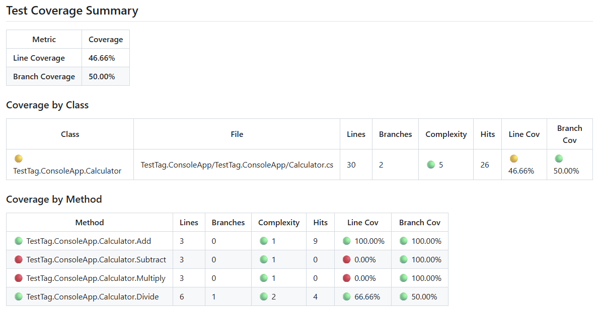

# Simple Code Coverage Report

**Stop switching tabs to check your coverage!** Get beautiful, detailed code coverage reports right where you need them - in your GitHub Actions workflow summary. No external services, no uploads, no waiting. Just push your code and see comprehensive coverage metrics with color-coded indicators that tell you instantly what needs attention.

Perfect for .NET projects using NUnit, xUnit, or MSTest. Works seamlessly on Ubuntu, Windows, and macOS runners. Zero configuration headaches - just add the action and go!

## Why Choose This Action?

🎯 **Instant Visibility** - Coverage reports appear directly in your GitHub Actions summary. No clicking through to external dashboards.

💰 **100% Free** - No account signup, no usage limits, no premium features locked away. Everything you need, nothing you don't.

🎨 **Smart Color Coding** - Green, yellow, and red indicators instantly show you what's well-tested and what needs work. Configure your own thresholds to match your team's standards.

📊 **Deep Insights** - Not just overall percentages. See coverage broken down by class and method, with complexity metrics and hit counts to guide your testing efforts.

⚡ **Zero Maintenance** - No external services to manage, no API keys to rotate, no vendor lock-in. It just works.



*Example coverage report showing class and method-level metrics with color-coded indicators*

## Features

- 📊 **Comprehensive Coverage Metrics**: Line coverage, branch coverage, complexity, and hit counts
- 🎨 **Color-Coded Indicators**: Visual feedback with 🟢 green, 🟡 yellow, and 🔴 red status
- 📋 **Detailed Tables**: Class-level and method-level coverage breakdowns
- ⚙️ **Customizable Thresholds**: Configure your own quality gates
- 🚀 **Cross-Platform**: Works on Ubuntu, Windows, and macOS runners
- 📝 **In-Workflow Display**: Results appear directly in GitHub Actions job summary

## Quick Start

### 1. Set Up Your Test Project

Add the `coverlet.collector` package to your test project:

```xml
<Project Sdk="Microsoft.NET.Sdk">
  <PropertyGroup>
    <TargetFramework>net10.0</TargetFramework>
    <IsPackable>false</IsPackable>
  </PropertyGroup>

  <ItemGroup>
    <PackageReference Include="Microsoft.NET.Test.Sdk" Version="18.0.1" />
    <PackageReference Include="NUnit" Version="4.4.0" />
    <PackageReference Include="NUnit3TestAdapter" Version="6.0.0" />
    <PackageReference Include="coverlet.collector" Version="6.0.4">
      <IncludeAssets>runtime; build; native; contentfiles; analyzers; buildtransitive</IncludeAssets>
      <PrivateAssets>all</PrivateAssets>
    </PackageReference>
  </ItemGroup>

  <ItemGroup>
    <ProjectReference Include="..\YourApp\YourApp.csproj" />
  </ItemGroup>
</Project>
```

### 2. Create a Coverage Settings File

Create a `Coverlet.runsettings` file in your repository root:

```xml
<?xml version="1.0" encoding="utf-8" ?>
<RunSettings>
  <DataCollectionRunSettings>
    <DataCollectors>
      <DataCollector friendlyName="XPlat code coverage">
        <Configuration>
          <Format>cobertura</Format>
          <Exclude>[*.Tests]*</Exclude>
          <ExcludeByAttribute>Obsolete,GeneratedCodeAttribute,CompilerGeneratedAttribute</ExcludeByAttribute>
        </Configuration>
      </DataCollector>
    </DataCollectors>
  </DataCollectionRunSettings>
</RunSettings>
```

### 3. Update Your GitHub Actions Workflow

Add the coverage collection and reporting steps to your CI workflow:

```yaml
name: CI

on:
  push:
  pull_request:
  workflow_dispatch:

env:
  SOLUTION_PATH: ./YourSolution.sln
  DOTNET_VERSION: '9.0.x'
  CONFIGURATION: Debug

jobs:
  build-and-test:
    runs-on: ubuntu-latest

    steps:
      - name: Checkout
        uses: actions/checkout@v4

      - name: Setup .NET
        uses: actions/setup-dotnet@v4
        with:
          dotnet-version: ${{ env.DOTNET_VERSION }}

      - name: Restore
        run: dotnet restore ${{ env.SOLUTION_PATH }}

      - name: Build
        run: dotnet build ${{ env.SOLUTION_PATH }} -c ${{ env.CONFIGURATION }} --no-restore

      - name: Test with Coverage
        run: |
          dotnet test ${{ env.SOLUTION_PATH }} \
            -c ${{ env.CONFIGURATION }} \
            --no-build \
            --logger "trx;LogFileName=test.trx" \
            --results-directory ${{ github.workspace }}/TestResults \
            --settings Coverlet.runsettings \
            --collect:"XPlat Code Coverage"

      - name: Generate Coverage Report
        if: ${{ always() }}
        uses: HermitOS/TestTag/.github/actions/SimpleCodeCoverage@main
        with:
          coverage-file-pattern: 'TestResults/**/coverage.cobertura.xml'
          cov-green-threshold: '50'
          cov-yellow-threshold: '20'
          complexity-green-threshold: '10'
          complexity-yellow-threshold: '20'

      - name: Upload Coverage Report
        if: ${{ always() }}
        uses: actions/upload-artifact@v4
        with:
          name: coverage-report
          path: TestResults/**/coverage.cobertura.xml
```

## Configuration Options

### Inputs

| Input | Description | Required | Default |
|-------|-------------|----------|---------|
| `coverage-file-pattern` | Glob pattern to find coverage XML files | No | `TestResults/**/coverage.cobertura.xml` |
| `cov-green-threshold` | Coverage percentage for green status (🟢) | No | `50` |
| `cov-yellow-threshold` | Coverage percentage for yellow status (🟡) | No | `20` |
| `complexity-green-threshold` | Complexity value for green status (🟢) | No | `10` |
| `complexity-yellow-threshold` | Complexity value for yellow status (🟡) | No | `20` |

### Threshold Logic

**Coverage Thresholds** (Line & Branch Coverage):
- 🟢 **Green**: Coverage ≥ `cov-green-threshold`%
- 🟡 **Yellow**: `cov-yellow-threshold`% ≤ Coverage < `cov-green-threshold`%
- 🔴 **Red**: Coverage < `cov-yellow-threshold`%

**Complexity Thresholds**:
- 🟢 **Green**: Complexity < `complexity-green-threshold`
- 🟡 **Yellow**: `complexity-green-threshold` ≤ Complexity < `complexity-yellow-threshold`
- 🔴 **Red**: Complexity ≥ `complexity-yellow-threshold`

**Overall Status**: The worst status among line coverage, branch coverage, and complexity determines the overall color indicator.

## Example Output

The action generates a comprehensive report in your GitHub Actions workflow summary with three detailed sections:

### Test Coverage Summary

| Metric | Coverage |
|--------|----------|
| **Line Coverage** | **46.66%** |
| **Branch Coverage** | **50.00%** |

### Coverage by Class

| Class | File | Lines | Branches | Complexity | Hits | Line Cov | Branch Cov |
|-------|------|-------|----------|------------|------|----------|------------|
| 🟡 TestTag.ConsoleApp.Calculator | TestTag.ConsoleApp/TestTag.ConsoleApp/Calculator.cs | 30 | 2 | 🟢 5 | 26 | 🟡 46.66% | 🟢 50.00% |

### Coverage by Method

| Method | Lines | Branches | Complexity | Hits | Line Cov | Branch Cov |
|--------|-------|----------|------------|------|----------|------------|
| 🟢 TestTag.ConsoleApp.Calculator.Add | 3 | 0 | 🟢 1 | 9 | 🟢 100.00% | 🟢 100.00% |
| 🔴 TestTag.ConsoleApp.Calculator.Subtract | 3 | 0 | 🟢 1 | 0 | 🔴 0.00% | 🟢 100.00% |
| 🔴 TestTag.ConsoleApp.Calculator.Multiply | 3 | 0 | 🟢 1 | 0 | 🔴 0.00% | 🟢 100.00% |
| 🟡 TestTag.ConsoleApp.Calculator.Divide | 6 | 1 | 🟢 2 | 4 | 🟡 66.66% | 🟢 50.00% |

*Color indicators show test quality at a glance: 🟢 Green (excellent), 🟡 Yellow (needs attention), 🔴 Red (requires testing)*

## Using with Different Test Frameworks

### NUnit (shown above)

Works out of the box with the configuration shown.

```xml
<ItemGroup>
  <PackageReference Include="Microsoft.NET.Test.Sdk" Version="18.0.1" />
  <PackageReference Include="NUnit" Version="4.4.0" />
  <PackageReference Include="NUnit3TestAdapter" Version="6.0.0" />
  <PackageReference Include="coverlet.collector" Version="6.0.4">
    <IncludeAssets>runtime; build; native; contentfiles; analyzers; buildtransitive</IncludeAssets>
    <PrivateAssets>all</PrivateAssets>
  </PackageReference>
</ItemGroup>
```

### xUnit
```xml
<ItemGroup>
  <PackageReference Include="Microsoft.NET.Test.Sdk" Version="18.0.1" />
  <PackageReference Include="xunit" Version="2.9.2" />
  <PackageReference Include="xunit.runner.visualstudio" Version="2.8.2" />
  <PackageReference Include="coverlet.collector" Version="6.0.4">
    <IncludeAssets>runtime; build; native; contentfiles; analyzers; buildtransitive</IncludeAssets>
    <PrivateAssets>all</PrivateAssets>
  </PackageReference>
</ItemGroup>
```

### MSTest
```xml
<ItemGroup>
  <PackageReference Include="Microsoft.NET.Test.Sdk" Version="18.0.1" />
  <PackageReference Include="MSTest.TestAdapter" Version="3.6.3" />
  <PackageReference Include="MSTest.TestFramework" Version="3.6.3" />
  <PackageReference Include="coverlet.collector" Version="6.0.4">
    <IncludeAssets>runtime; build; native; contentfiles; analyzers; buildtransitive</IncludeAssets>
    <PrivateAssets>all</PrivateAssets>
  </PackageReference>
</ItemGroup>
```

## Cross-Platform Support

This action works on all GitHub-hosted runners:
- ✅ `ubuntu-latest` (uses native bash)
- ✅ `windows-latest` (uses Git Bash)
- ✅ `macos-latest` (uses native bash/zsh)

The action explicitly uses `shell: bash`, ensuring consistent behavior across platforms.

## Troubleshooting

### No Coverage File Found

If you see "⚠️ No coverage file found", check:

1. **Test command includes coverage collection**:
   ```yaml
   --results-directory ${{ github.workspace }}/TestResults --settings Coverlet.runsettings --collect:"XPlat Code Coverage"
   ```

2. **Coverlet.runsettings has Cobertura format**:
   ```xml
   <Format>cobertura</Format>
   ```

3. **TestResults directory exists**:
   The `--results-directory ${{ github.workspace }}/TestResults` flag should match your pattern.

4. **Pattern matches file location**:
   Coverage files are typically in `TestResults/{guid}/coverage.cobertura.xml`

### Tests Not Found

Ensure your test project has:
- Test framework package (NUnit, xUnit, MSTest)
- Test adapter package
- Project reference to the code being tested

### Coverage Shows 0%

Check your `Coverlet.runsettings` exclusions:
```xml
<Exclude>[*.Tests]*</Exclude>
```
This excludes test assemblies. Make sure you're not accidentally excluding your application code.

## Advanced Configuration

### Multiple Test Projects

If you have multiple test projects, the coverage files will be collected from all of them:

```yaml
- name: Test with Coverage
  run: dotnet test ${{ env.SOLUTION_PATH }} --results-directory ${{ github.workspace }}/TestResults --settings Coverlet.runsettings --collect:"XPlat Code Coverage"
```

The action will find all `coverage.cobertura.xml` files and report on the first one found. To combine multiple coverage files, use a tool like `dotnet-coverage` to merge them first.

### Custom Coverage Location

If your coverage files are in a different location:

```yaml
- name: Generate Coverage Report
  uses: HermitOS/TestTag/.github/actions/SimpleCodeCoverage@main
  with:
    coverage-file-pattern: 'artifacts/**/coverage.cobertura.xml'
```

### Strict Quality Gates

For projects requiring high coverage:

```yaml
- name: Generate Coverage Report
  uses: HermitOS/TestTag/.github/actions/SimpleCodeCoverage@main
  with:
    cov-green-threshold: '80'    # Green only if 80%+
    cov-yellow-threshold: '60'   # Yellow between 60-80%
    complexity-green-threshold: '5'   # Green if complexity < 5
    complexity-yellow-threshold: '10' # Yellow if complexity 5-10
```

## License

This action is available under the MIT License.

## Contributing

Contributions are welcome! Please feel free to submit issues or pull requests.
